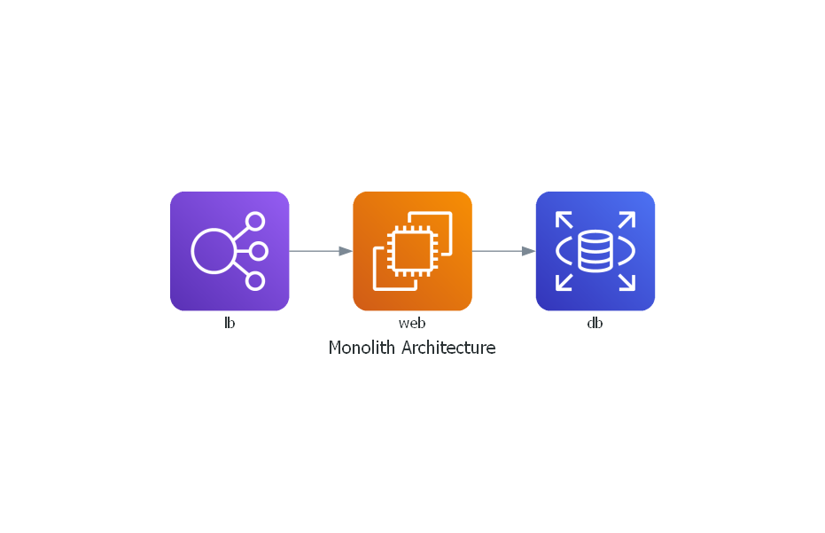

# Arch Diagrams Template Repository

This repository provides templates for creating various architectural diagrams using the [Diagrams](https://diagrams.mingrammer.com/) library in Python. These diagrams are useful for Architecture Decision Records (ADRs) and other documentation purposes.

## Getting Started

### Prerequisites

- Python 3.6 or higher
- Graphviz

#### Installing Graphviz

**Windows:**

Download the installer from the [Graphviz website](https://graphviz.gitlab.io/download/).

**macOS:**

```sh
brew install graphviz
```

**Linux (Debian/Ubuntu):**

```sh
sudo apt-get install graphviz
```

### Installation

1. Clone this repository:
    ```sh
    git clone https://github.com/yourusername/diagrams-template-repo.git
    cd diagrams-template-repo
    ```

2. Create a virtual environment and activate it:
    ```sh
    python -m venv venv
    source venv/bin/activate  # On Windows use `venv\Scripts\activate`
    ```

3. Install the required Python packages:
    ```sh
    pip install -r requirements.txt
    ```

### Usage

Navigate to the `diagrams` directory and execute the desired Python script to generate the diagram. For example:

```sh
python diagrams/monolith.py
```

This will generate an image file of the diagram in the same directory.

### Diagram Templates

#### Templates Explanation

1. **Monolith**: A single-tiered software application in which different components are combined into a single program.
2. **Microservices**: An architectural style that structures an application as a collection of loosely coupled services.
3. **Load Balancing**: Distributing network or application traffic across multiple servers.
4. **IoT**: Internet of Things architecture typically includes IoT devices, data processing, and storage.
5. **Multi Client-Server**: Architecture that includes multiple client types interacting with a central server and database.


#### Monolith



```python
# diagrams/monolith.py

from diagrams import Diagram
from diagrams.aws.compute import EC2
from diagrams.aws.database import RDS
from diagrams.aws.network import ELB

with Diagram("Monolith Architecture", show=False):
    ELB("lb") >> EC2("web") >> RDS("db")
```

#### Microservices


```python
# diagrams/microservices.py

from diagrams import Diagram
from diagrams.aws.compute import EC2
from diagrams.aws.database import RDS
from diagrams.aws.network import ELB

with Diagram("Microservices Architecture", show=False):
    lb = ELB("lb")
    svc_group = [EC2("web1"), EC2("web2"), EC2("web3")]
    db = RDS("db")

    lb >> svc_group >> db
```

#### Load Balancing


```python
# diagrams/load_balancing.py

from diagrams import Diagram
from diagrams.aws.compute import EC2
from diagrams.aws.network import ELB

with Diagram("Load Balancing Architecture", show=False):
    ELB("lb") >> [EC2("web1"), EC2("web2"), EC2("web3")]
```

#### IoT


```python
# diagrams/iot.py

from diagrams import Diagram
from diagrams.aws.iot import IotCore
from diagrams.aws.compute import Lambda
from diagrams.aws.database import DynamoDB

with Diagram("IoT Architecture", show=False):
    IotCore("iot") >> Lambda("lambda") >> DynamoDB("db")
```

#### Multi Client-Server


```python
# diagrams/multi_client_server.py

from diagrams import Diagram
from diagrams.aws.compute import EC2
from diagrams.aws.database import RDS
from diagrams.aws.network import ELB
from diagrams.generic.device import Mobile
from diagrams.generic.device import Tablet

with Diagram("Multi Client-Server Architecture", show=False):
    lb = ELB("lb")
    web = EC2("web")
    db = RDS("db")

    Mobile("mobile") >> lb >> web >> db
    Tablet("tablet") >> lb >> web >> db
```

## Contributing

Feel free to submit pull requests with improvements and additional templates.

## License

This project is licensed under the MIT License - see the [LICENSE](LICENSE) file for details.
